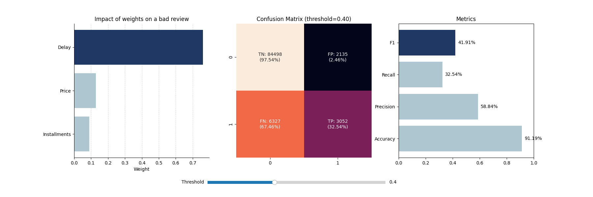

# E-commerce Customer Satisfaction Analysis
### Predicting delivery-driven bad reviews using logistic regression built from scratch

## Business Problem
In e-commerce, a single bad review can cost more than the order itself. 
This project identifies which orders are at highest risk of generating 
a negative review — before the customer writes it.

**Key finding:** Delivery delay is the dominant driver of bad reviews, 
with 6x stronger signal than order value and 8x stronger than payment 
installments. Logistics quality, not price, determines customer satisfaction.

## Results
| Metric | Value |
|--------|-------|
| Accuracy | 90.76% |
| Precision | 54.15% |
| Recall | 35.3% |
| F1 Score | 42.74% |

*Note: Class imbalance (89% positive reviews) makes accuracy misleading — 
F1 score is the relevant metric for minority class detection.*

## Feature Experimentation
Additional features were tested to improve model performance:

- **Freight value** (shipping cost per order): Showed the second strongest weight after delivery delay (0.2592), but did not improve F1 due to high correlation with price — both features compete for the same signal.
- **Customer state** (one-hot encoded, 26 features): Added no predictive value. F1 decreased slightly from 41.91% to 40.73%.
- **Classification threshold**: Optimized from 0.4 to 0.375 using the interactive dashboard, improving F1 from 41.91% to 42.74%.

### Key Takeaway
Delivery delay is the dominant predictor of bad reviews (weight: 0.76). Other features like price, installments, shipping cost, and customer location add marginal value. The business implication is clear: improving delivery reliability is the most effective way to reduce negative reviews.

## Technical Approach
- **Data pipeline:** DuckDB in-memory SQL with CTEs joining orders, 
payments and reviews across 100k+ transactions
- **Model:** Logistic regression implemented from scratch in Python — 
gradient ascent on log-likelihood, weighted gradient for class imbalance, 
sigmoid numerical stability via clipping
- **No sklearn** — mathematics implemented manually to demonstrate 
understanding of underlying algorithms

## What the Model Learned
| Feature | Weight | Interpretation |
|---------|--------|----------------|
| Delivery delay | 0.7604 | Strongest signal by far |
| Order value | 0.1288 | Expensive disappointments hurt more |
| Installments | 0.0891 | Marginal effect |

## Interactive Dashboard
The script includes an interactive dashboard built with matplotlib widgets. A threshold slider allows real-time exploration of the precision-recall tradeoff without retraining the model.

The dashboard displays:
- Feature weight distribution (static)
- Confusion matrix with row-normalized percentages (updates live)
- Metrics panel showing Accuracy, Precision, Recall, and F1 (updates live)

## Learning Philosophy
This project is part of my self-directed journey into machine learning 
through mathematics rather than frameworks. Before using libraries like 
sklearn, I am building algorithms from scratch to understand what happens 
beneath the abstraction.

Current focus areas:
- Understanding gradient descent/ascent through manual implementation
- Building intuition for probability and log-likelihood
- Learning why class imbalance breaks accuracy as a metric

This means the code prioritises clarity and mathematical transparency 
over production optimisation.

## Stack
Python · DuckDB · NumPy · Pandas

## Run
pip install -r requirements.txt
python end_to_end_01_workcode.py
